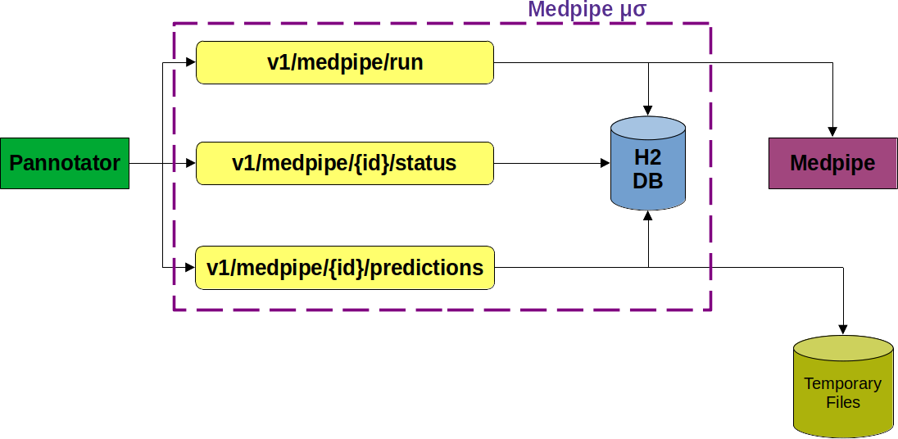
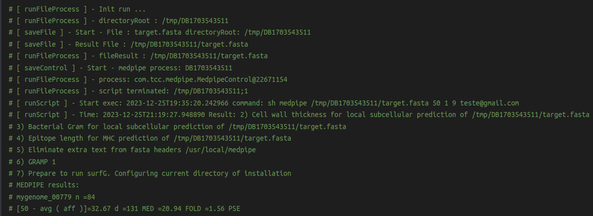

Pannotator integrated with Medpipe provides immunological and subcellular location features using a microservice
================================================================================================================

This microservice was developed using the Kotlin language to deliver the local subcellular and the Mature Epitope Density predicted by the software MEDPIPE for a protein multifasta file. This software is a partial requisite for Rafael Gonçalves' final paper at the Federal University of Uberlândia, Brazil

Supplementary Material
======================

Running the Medpipe microservice
-------------------
A good thing about microservices is that you can have multiple servers running them. In case of down-service of one, we can try another. 
I intend to have at least three servers providing the Medpipe microservice. To change to a new server, you should alter the "server" variable in the [script](https://raw.githubusercontent.com/santosardr/medpipe-ms/main/medpipe-ms-call).
The below [script](https://raw.githubusercontent.com/santosardr/medpipe-ms/main/medpipe-ms-call) sends the target file to the server. After finishing the processing, three reports will be returned and printed.

```bash
#!/bin/bash
server="bioinfo.facom.ufu.br"
email="medpipe.agent@gmail.com" #This the sender address. You can try your own e-mail to have the medpipe files stored in your mailbox.

dirfastaFile=target.fasta # Do not alter this file name
cellWall="65" # Measure in amino acids
organismGroup="1" # 0=gram-negative, and 1=gram-positive bacteria
medpipePostURL="curl --location "$server"/v1/medpipe/run --form file=@$dirfastaFile --form cellWall=$cellWall --form organismGroup=$organismGroup --form email=$email"
echo "URL: $medpipePostURL"
processId=`$medpipePostURL`
echo "Result: $processId"

getStatusUrl="curl --location $server/v1/medpipe/$processId/status"
statusexec=`$getStatusUrl`
echo "status: $statusexec"

while [ $statusexec -gt 0 ]; do
    echo "Status: $statusexec"
    sleep 20
    getStatusUrl="curl --location $server/v1/medpipe/$processId/status"
    statusexec=`$getStatusUrl`
done        
echo "The microservice is done. Results:"

getUrl="curl --location $server/v1/medpipe/$processId/predictions 2>/dev/null"
Result=$(eval "$getUrl")
echo "MED stats:"
echo $Result

getUrl="curl --location $server/v1/medpipe/$processId/tmh 2>/dev/null"
Result=$(eval "$getUrl")
echo "TMH:"
echo $Result

getUrl="curl --location $server/v1/medpipe/$processId/signal 2>/dev/null"
Result=$(eval "$getUrl")
echo "SIGNAL:"
echo $Result
```

I added a test file comprising two secreted proteins called ["target.fasta"](https://raw.githubusercontent.com/santosardr/medpipe-ms/main/target.fasta). However, feel free to try your proteins.

```text
>Cp1002_0126a
MHFKTRMSLFCTATTAATSLAVASLQPAAAVEQPSNTIVSTIMLPTKATVTKTFTVSSTK
GTARADYSSNSITVQPGDTISVKIHSQGGYTEFSELTEFVPSVGRLHTESITFKEGDSGP
HPLKVAGWNATSQADRVTFRTNDGKPKAITLDTTLEYTYTVGVRATGDPSTRFQLSSSDS
NTVFTSASGPKIHVKKTLPSWLSGAFPGAIFDSLTNLLSPILRALNIL
>Cp1002_1802
MLFPSRFQGTFLKPLITAALAVFCVGFTPATAQVIPYTDPDGFYTSIPSAENTTPGTVLS
QRDVPMPVLDVLVKMKRIAYTSTHPNGFSTPVTGAVLLPTAPWRGPGPRPVALLAPGTQG
AGDSCAPSKLLTMGGEYEMFSAAALLNRGWTVAVTDYQGLGTPGNHTYMNRKAQGAALLD
LGRAITTLNLPDVNNHTPIIPWGYSQGGGASAAAAEMHRAYAPDVNVVLAYAGGVPANLL
SVSSSLEGTALTGALGYVITGMYEIYPEIREPIHNFLNTRGQVWLDQTSRDCLPESLLTM
PLPDTSILTVSGQRLTSLISDDVFQRAISEQQIGLTAPDIPVFVAQGLNDGIIPAEQARI
MVNGWLSQGADVTYWEDPSPALDKLSGHIHVLASSFLPAVEWAEQRLAALGQPTP
```
It's important to note that complex names should be avoided. Otherwise, third-party software may trigger execution failures. As a precaution, I use the [valifasta](https://github.com/santosardr/non-CSPs/tree/main/src/valifasta) software to 'clean' protein files before running Medpipe. Please be aware that this important preprocessing step still needs to be implemented in the Medpipe microservice.


Medpipe microservice Overview 
-------------------

The source code for the microservice can be found on GitHub, and the
project has received the name Medpipe microservice referencing the Medpipe tool
that the microservice runs. The Medpipe microservice has three essential
endpoints. The Medpipe script execution endpoint is used for directory
preparation, temporary execution of files generated by Medpipe, and
asynchronous execution of the script. Alternatively, it even makes use
of H2 to record the status of the process and the generated directory
for later consultation. The process status search endpoint is used to
provide information about the status of Medpipe processing. This
functionality is used to find out if the processing of the Medpipe
script has finished and if there were execution errors. The Medpipe
prediction search endpoint is used to extract the results generated by
Medpipe and return them to the user.

### Execution of Medpipe

The Medpipe execution endpoint is triggered by an HTTP request using the
POST verb in the /v1/medpipe/run route. It is an essential component of
Medpipe microservice and is responsible for processing requests for the execution
of the Medpipe script. It plays a central role in the automation of
Medpipe processing, enabling users to submit files and parameters
relevant to the execution of the Medpipe script.

### Medpipe microservice technical details

Request type: POST Rota: /v1/medpipe/run Input Parameters:

- file: This parameter represents the Medpipe processing file. It is of
the MultipartFile type, which is commonly used to handle file sending in
web applications.

- cellWall: Measurement of cell wall thickness in amino acids.

- organism group: Group of organisms, currently accepted values are 0
for gram-negative or 1 for gram-positive bacteria.

- epitopeLength: Epitope length.

- E-mail: E-mail to send the results generated by Medpipe.

- membraneCytoplasm: A value of 1 considers predicting membrane and
cytoplasmic proteins in addition to the default exported proteins. A
zero value focuses only on the default.

- Directory Creation: First, use the buildDirectory function to build
the Full path to a temporary directory where the results of the
processing will be stored. This directory is generated in the folder
\"temp\" with the name \"MsMedpipe\" concatenated with the timestamp to
prevent duplication of Names.

- File Saving: Use the saveFile function to save the file received in
the HTTP requests in the specified directory. That is essential because
the Medpipe script requires access to the file.

- Process Control: In addition, a MedpipeControl object is created to
track the process\'s status. This object is saved in the database and
serves as a Medpipe processing progress monitoring tool.

- Medpipe script execution: We construct a shell command incorporating
all the given parameters, including the file path, details on the cell
wall, group of organisms, and others. This command is executed through
the Runtime.getRuntime().exec() function, which performs the Medpipe
script in an asynchronous process.

- Status Update: The status of the process is updated based on the
result of the script execution. If the run is successful, the status is
set to done. If failure, the status indicates an error. It is worth
noting that the runFileProcess function is annotated with \@Async, which
means that it runs on a separate thread. We accomplish that to ensure
that the loop command does not block the main thread of the service and
allows other requests to be processed efficiently, improving the
scalability of Medpipe microservice. Code 1 is responsible for running Medpipe.


### Search Processing Status

Status lookup is an endpoint that handles HTTP GET requests on the route
/v1/medpipe/{id}/status. Its main purpose is to check the status of a
Medpipe process based on the ID provided as a parameter in the Uniform
Resource Locator (URL) of the request. Its operation is relatively
simple.

Request Type: GET Rota: /v1/medpipe/{id}/status Input Parameter

- id: Parameter related to the processing of Medpipe, with which it is
possible to search in the base H2 status information and file generation
directory.

- Receiving the ID: The function receives the process ID as part of the
URL of the HTTP request. The Spring Framework automatically extracts
this ID due to annotation \@PathVariable. - Status Query: The function
invokes the findStatusProcess method of the MedpipeService service,
passing the ID as an argument. This call to service is responsible for
querying the status of the process in the database.

- Result Return: The status of the process, which is returned by the
service, is then returned because of the getStatus function. The status
is of type Long, allowing it to return an integer value representing the
status of the process. This status can assume three pre-established
values.

- Zero: Indicates that the process has been completed successfully.

- 1: Indicates that the process is still running and should wait.

- -500: Indicates that there was an error in the processing.

- -404: Indicates that no one was found in the database process
referring to the ID received by the requisition. The endpoint gives
users the ability to access information in real-time on the progress of
Medpipe processes. It plays a key role in the transparency and
monitoring of Medpipe script data processing.

Code 2 is responsible for fetching the processing status.


### Searching for Medpipe predictions

The fetching of forecasts generated by Medpipe is an endpoint that
handles HTTP requests using the GET verb in the
/v1/medpipe/{id}/predictions route. The goal is to allow customers to
view the predictions generated by Medpipe.

Request Type: GET Rota: /v1/medpipe/{id}/predictions Input Parameter

- id: Parameter related to the processing of Medpipe, allowing searching
in the base H2 status information and file generation directory.

- Receiving the ID: The function receives the process ID as part of the
HTTP request\'s URL. The Spring Framework automatically extracts this ID
due to the \@PathVariable annotation. The received ID is used in the
getPrediction function to get the processing predictions from the
Medpipe script based on the ID provided.

- Process fetching: Internally, the getPrediction function uses the
findProcess function to retrieve a MedpipeControl object based on the
id. If the process is not encountered, an exception is thrown,
indicating an HTTP 404 (NOT FOUND) status.

- File Search: After searching in the database, the MedpipeControl
object contains the store directory with predictions.

- Result assembly: With the file path obtained, the function reads the
file of results line by line using a BufferedReader. Each line is
processed and removed, including information such as gene ID, numerical
prediction, and type of protein, and added to a StringBuilder instance.
The getPredictions endpoint provides customers with the ability to
access and download Medpipe processing results efficiently. It plays a
crucial role in making the results available for subsequent analysis or
local storage, making the Medpipe microservice a versatile and useful tool for
users. Code 3 is responsible for fetching the predictions generated by
Medpipe.


Medpipe microservice Installation
-----------------------

In this section, we detail the process of generating and installing the
Medpipe microservice executable. The source code for the microservice can be found
on GitHub.

### Dependencies

- Java Virtual Machine: The Kotlin language\'s build process is in the
Java Virtual Machine (JVM). The required version is 11, and the \"JAVA
HOME\" environment variable must be configured.

- Maven: Maven, a build tool, needs to be properly configured to run. It
is necessary to download version 3.8 or later. Configure the environment
variable \"M2 HOME\" with the directory where the installation of the
maven is, for example: \"M2 HOME=/home/apache-maven-3.8\". Then, include
the \"M2 HOME\" variable in the System Path pointing to the maven bin
folder, for example: \"PATH=\$PATH:\$M 2 HOME/bin\".

### Compilation process 

To compile the project, one needs to use the maven \"mvn\" command.
Using the system command line, navigate to the root directory from the
Medpipe microservice project and type \"mvn clean install.\" This command will
download the project\'s dependencies, compile its classes, and create a
target folder, and inside it, we will have a generated \".jar\" file.
The generated file follows the terminology that was configured in the
pom.xml of the project (Code 4). The result is the combination of the
name and version fields generating the file
\"ms-medpipe-1.0.0-Release.jar\".


### Installation

After compiling the project, the generated file
\"ms-medpipe-1.0.0-Release.jar\" should be copied to Medpipe\'s root
folder. The command executes the project: \"java-en
ms-medpipe-1.0.0-Release.jar.\"

### Pannotator Integration

In this section, we will describe how the Pannotator integrates with the
Medpipe microservice using the endpoints. Pannotator and Medpipe are basically
bash scripts that can be run from the command line or through their web
interfaces. With the development of Medpipe microservice, Pannotator now runs
Medpipe through an API call exposed on the internet. Figure 1S shows
this integration. The execution of Medpipe is done by the
/v1/medpipe/run route and has been included in the Pannotator after
updating the target fasta file. The FASTA format is used to store
nucleotide sequences and proteins.




Code 5 defines the medpipePostURL variable to store a curl command used
to send a POST request to the /v1/medpipe/run route. To proceed with
that, one needs to specify the URL, the FASTA file to be sent, and the
parameters required for the analysis. The command specified in the
medpipePostURL variable is executed and stores the output in the
medpipeexec variable. The API return is composed of Medpipe\'s
processing ID. The ID returned by the execution service is used to
obtain the information from the Medpipe process that has been initiated.
The status endpoint receives this ID as a parameter and returns the
status that is being processed.


Code 6 executes the GET command to the Medpipe Processing Status API.
After the Medpipe run is finished and the status is zero, the next step
is to fetch the predictions generated by Medpipe.


Code 7 runs the fetching API for the projections generated by Medpipe.
The Pannotator uses these predictions to enrich the execution of the
results.


### Documentation

To make the microservice easier to understand and use, it is essential
to provide clear documentation. The following are details on how to
interact with the endpoints of Medpipe microservice.

#### Endpoint Documentation

Documentation for REST endpoints is available in the Swagger API,
accessible under \"http://localhost:\[port
configured\]/swagger-ui.html\". The documentation provides detailed
information about each endpoint, as shown in Figure 2S, including the
HTTP methods allowed and the expected responses.


#### Logs

Ensuring proper visibility into microservice operations and performance
is critical. To this end, logging resources were implemented for data
analysis. Medpipe microservice generates detailed logs, recording relevant
information about each operation, including data about incoming
requests, responses sent, events, and any critical activities; an
example can be found in Code 8.


